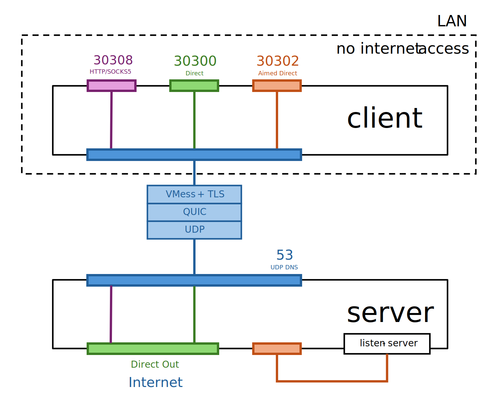

# StuTunnels

For students in campus, use udp tunnel to access the internet.

## Usage

Run docker on your server:

```bash
docker compose up -d
```

Then run the client on your computer:

```bash
sing-box -c client.json
```

For more information about `sing-box`, please refer to the [sing-box documentation](https://sing-box.sagernet.org/).

## How it works

Most campus networks doesn't block `53/udp` (DNS) traffic, we can use QUIC protocol to tunnel the traffic through `53/udp` port.

This project use [sing-box](https://github.com/SagerNet/sing-box) to encrypt TCP/UDP traffic with vmess+tls, and transport over QUIC (UDP) tunnel to `53/udp` port on the server.

Sing-box client configuration is at [client.json](client.json), and the server configuration is at [data/server.json](data/server.json).

Following is the **schematic diagram** according to the given configuration:



## Preparation

Generate a certificate and key for the server:

```bash
# create private key
openssl genpkey -algorithm RSA -out server.key -aes256 -pkeyopt rsa_keygen_bits:2048
# create certificate signing request
openssl req -new -key server.key -out server.csr
# create self-signed certificate
openssl x509 -req -days 365 -in server.csr -signkey server.key -out server.crt
```

Move the generated files to the [data/](data/) directory.

Modify configuration in [client.json](client.json) to match your Common Name (CN) in the certificate.

## Configuration

You may need to modify the configuration in [client.json](client.json) and [data/server.json](data/server.json). Mostly the following fields:

- All ports configurations.
- The `user` field in client inbound (`in.mixed`), which configure the HTTP/SOCKS5 authentication.
- The `uuid` fields in both client (`out.vmess-quic`) and server (`in.vmess-quic`), which should match each other.
- The `server` field in client outbound (`out.vmess-quic`), which should point to the server's IP address.
- The `tls.server_name` field in client outbound (`out.vmess-quic`), which should match the Common Name (CN) in the server certificate.

Modify [docker-compose.yml](docker-compose.yml) to match your IP address and port configurations.

> [!NOTE]
> The `ports` field listens `53/udp` which may conflict with your machine, so please add a host port mapping to avoid conflicts. For example, `10.10.10.10:53:60606/udp`.

## Connections and Testing

In the given configuration, the client will start the following services:

- HTTP/SOCKS5: `30308`
- Connection Test: `30302`
- Direct Forwarding: `30300`

*Connection Test* means that you can use `nc`/`ncat` to test the connection to the server ([listentt](https://github.com/Cnily03/listentt)). For example:

```bash
nc 127.0.0.1 30302
nc -u 127.0.0.1 30302
```

*Direct Forwarding* allows you to forward traffic to this port.

## Further work

You can add the HTTP/SOCKS5 proxy on Clash or other tools. Then you can take advantages of OpenWrt or `iptables`/`nftables` to redirect/forward traffic to the proxy, secheduled or conditionally.

## License

Copyright (c) 2025 Cnily03. All rights reserved.

Licensed under the [MIT License](LICENSE).
